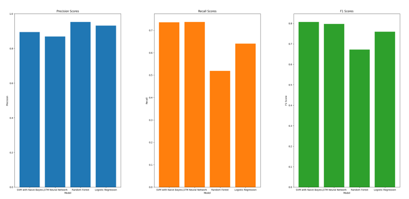
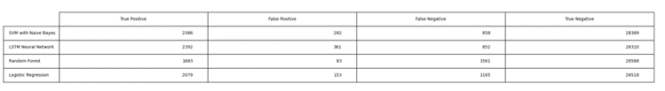
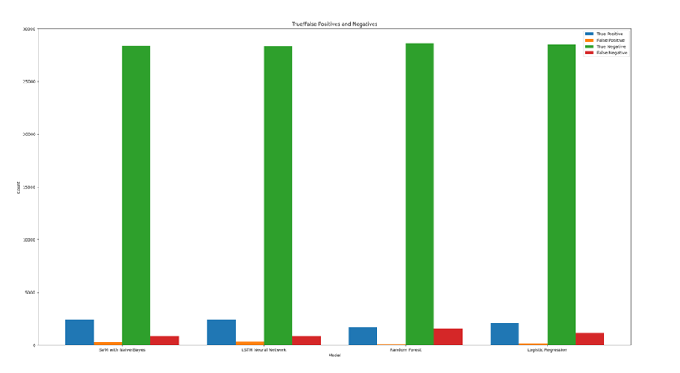

# Toxic-Comment-Classification

Four supervised machine learning classifiers were developed and evaluated for their ability to predict whether a social media comment is toxic or not. These classifiers include Logistic Regression, Random Forest, Support Vector Machine with Naive Bayes Features, and LSTM Neural Network.

# Preprocessing
The first step was to preprocess the data from the Kaggle Toxic Wikipedia Comments dataset. This involved removing any identifying information such as IP addresses and removing null values.

# Feature Engineering
Next, feature engineering was performed on the preprocessed data to extract useful features that could be used to train ML classifiers. Some of the features extracted include comment length, capitalization percentage, number of profanities, number of exclamation points, number of question marks, and TF-IDF. TF-IDF is a common technique used in NLP to reflect the importance of a term in a large document corpus.

# Models
Several ML classifiers were trained on the preprocessed and engineered data to compare their performance on the task of toxic comment classification. The models used include:

Logistic Regression: A linear model that uses a logistic function to estimate the probability of a binary outcome.

Random Forest: An ensemble model that combines multiple decision trees to make predictions.

Support Vector Machine with Naive Bayes Features: A model that uses both SVM and Naive Bayes algorithms to classify text.

LSTM Neural Network: A deep learning model that uses recurrent neural networks to capture sequential dependencies in text.

# Results

  <!-- Line break -->
Figure 1: Bar graphs depicting the precision, recall, and F1 scores for all 4 models.

  <!-- Line break -->
Figure 2: True/False positives and negative results for all 4 models.

  <!-- Line break -->
Figure 3: Bar graphs depicting the True/False positives and negative results for all 4 models.

## Best-Performing Models

- The **SVM model** with Naive Bayes features and the **LSTM (Long Short-Term Memory) model** performed the best among the tested models.

## Worst-Performing Models

- The **Random Forest** and **Logistic Regression** models performed the worst among the tested models.

### SVM Model

- The SVM model's strong performance may be attributed to its ability to separate classes in high-dimensional data using a hyperplane.
- The addition of Naive Bayes features, which utilize word probabilities, further improved the SVM model's performance.
- The SVM model achieved high precision and recall scores, indicating correct identification of positive cases with few false positives.

### LSTM Model

- The LSTM model performed well due to its capacity to remember context, previous inputs, and recognize patterns in toxic comments.
- While the LSTM had slightly lower precision and recall scores compared to the SVM, it still performed admirably.
- Further hyperparameter tuning might enhance the LSTM model's performance.

### Random Forest Model

- The Random Forest model exhibited a lower recall score, potentially because it relies on an ensemble of decision trees.
- It may suffer from underperformance if an insufficient number of trees are used, leading to incomplete information.
- Overfitting to the training data could contribute to lower recall scores on new data.

### Logistic Regression Model

- Logistic regression may struggle to capture the complex relationships between words and their use in language, impacting its classification accuracy.
- It may perform poorly when encountering words it was not trained on, resulting in a higher rate of false negatives.
- Logistic regression may not handle imbalanced data well, further affecting its recall score.

